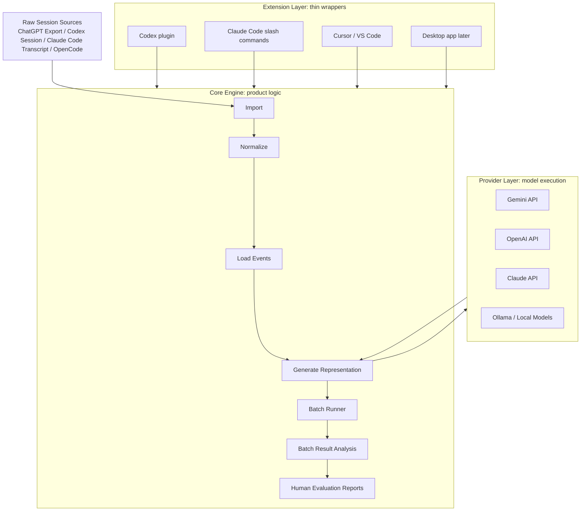
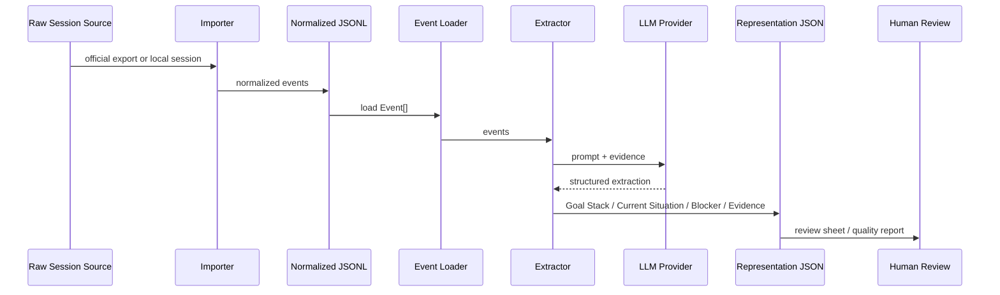

# Architecture

## Current Positioning

This project is currently an **Evidence-grounded Session Representation Engine**.

The core purpose is to turn long AI sessions into compact, evidence-backed representations that help a human understand and resume the session quickly.

The current representation focuses on:

- Goal Stack
- Current Situation
- Blocker
- Evidence

The long-term vision may become a **Session Supervision Layer**, but the current implementation should not overclaim that position yet.

## Layer Model

The project should be understood as three layers:

1. Core Engine
2. Extension Layer
3. Provider Layer



## Core Engine

The Core Engine is the center of the product.

It owns:

- importing session sources
- normalizing provider-specific data into JSONL
- loading normalized events
- rendering evidence-grounded prompts
- validating structured representation output
- running batch extraction
- analyzing batch results
- generating review and evaluation reports

The Core Engine should remain useful without Codex, Claude Code, Cursor, VS Code, or a desktop app.

Those tools should make the engine easier to invoke, but they should not contain the product logic.

Current implementation status:

- The current engine is mostly Python.
- Importers, loader, extractor, evaluator, health checks, and batch runner are Python.
- Node may be useful later for plugin or editor wrappers, but it should not become the core prematurely.

## Extension Layer

The Extension Layer should consist of thin wrappers around the Core Engine.

Examples:

- Codex plugin
- Claude Code slash commands
- Cursor extension
- VS Code extension
- Desktop app

These extensions should call the Core Engine rather than reimplement it.

Good extension responsibilities:

- pass a session path to the Core Engine
- invoke import
- invoke batch representation generation
- open generated review files
- display report outputs

Bad extension responsibilities:

- owning representation schema
- duplicating provider logic
- implementing separate extractors
- maintaining separate evaluation behavior
- introducing provider-specific behavior outside the Core Engine

The desired relationship is:

```text
Extension command
  -> Core CLI
    -> normalized data / representation / report
```

This keeps the product independent from any single AI coding tool.

## Provider Layer

The Provider Layer is responsible for model execution.

Long-term provider candidates:

- Gemini API
- OpenAI API
- Claude API
- Ollama / local models

Current implementation status:

- Gemini and OpenAI are supported in the current extractor path.
- Gemini is called through an OpenAI-compatible endpoint.
- Provider-specific code is still small and should not be over-abstracted yet.

Important principle:

> Do not over-abstract providers too early.

Provider abstraction should be extracted only when real divergence appears, for example:

- Claude API is actually implemented.
- Ollama/local model behavior is tested.
- provider-specific structured output handling becomes meaningfully different.
- retry, token, or quota handling becomes provider-specific enough to justify a shared interface.

Until then, provider support should remain simple and practical.

## Current Data Flow



## Current Phase: Phase 0.5

The project is currently in **Phase 0.5: Human Evaluation support**.

The priority is not feature expansion.

The priority is to answer:

> Does the current representation help humans understand real AI sessions quickly?

Current priorities:

- batch representation generation on real imported sessions
- success/failure measurement
- empty or malformed field inspection
- representation length analysis
- evidence volume analysis
- suspicious sample detection
- Human Evaluation candidate selection
- review sheet generation

Non-priorities in Phase 0.5:

- dashboard
- desktop app
- plugin packaging
- new health detectors
- Session Supervision behavior
- large provider refactor
- premature provider framework

## Why Provider Refactoring Is Not Next

Provider refactoring is tempting because the project clearly has a future Provider Layer.

However, it is not the next highest-leverage task.

The immediate risk is not that provider code is too messy. The immediate risk is that the representation has not yet been sufficiently validated on real data.

Before investing in provider architecture, the project needs better answers to:

- Does Goal Stack help across many real sessions?
- Does Current Situation reduce time-to-understanding?
- Is Blocker reliable or too broad?
- Are Evidence IDs sufficient for human verification?
- Which session types produce weak representations?
- How often does the schema produce too much output?

Therefore, the next code task should not be Provider refactoring.

## Next Recommended Code Task

The next code task should be:

> Batch Result Analysis Report CLI

This CLI should analyze a folder of generated representation JSON files and produce a quality report.

It should summarize:

- total input sessions
- representation success/failure count
- skipped count
- empty Goal Stack count
- empty Current Situation count
- empty Blocker count
- blocker status distribution
- goal shift distribution
- evidence count distribution
- representation length statistics
- suspicious samples
- recommended Human Evaluation candidates

This supports Phase 0.5 directly without changing:

- Importer
- Extractor prompt
- Representation schema
- Evaluator
- Provider behavior

## Strategic Summary

The project should stay centered on the Core Engine.

The Core Engine should produce evidence-grounded representations from AI sessions.

Extensions should remain thin wrappers.

Providers should be replaceable, but not over-abstracted before real needs appear.

Phase 0.5 should focus on Human Evaluation and batch quality analysis.

The next implementation priority is not more providers, not a dashboard, and not supervision. It is a report CLI that helps evaluate whether the current representation is actually useful.

